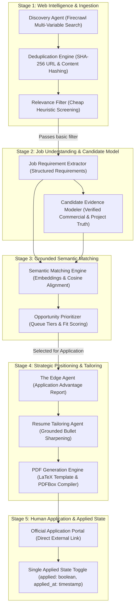
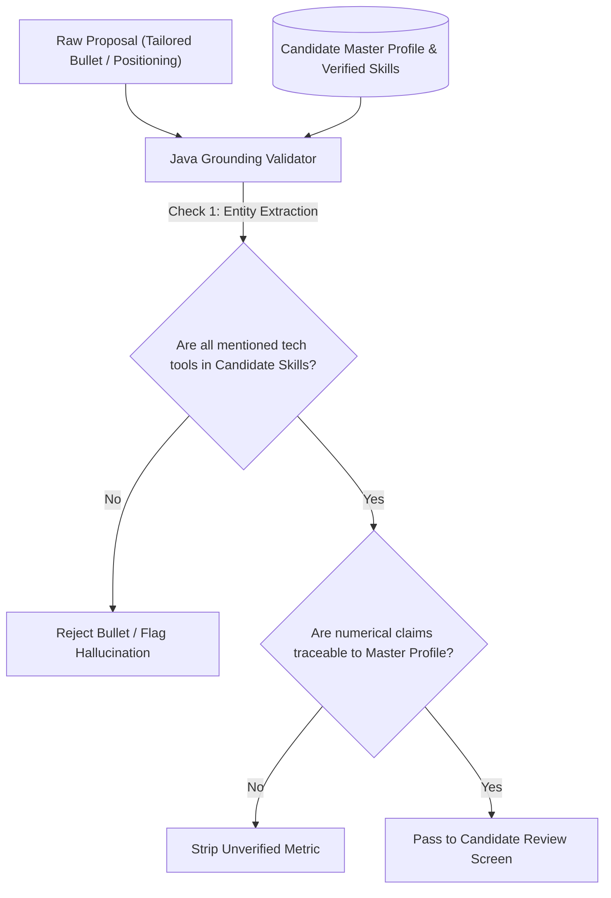

# JobHunter AI — Agent Architecture & LLM Orchestration

## 1. Multi-Agent Design Philosophy

JobHunter AI utilizes a specialized multi-agent workflow where each autonomous agent has a well-defined, single responsibility. The architecture enforces five strict rules:

1. **Deterministic Guards Around Non-Deterministic LLMs**: All LLM outputs are validated against JSON schemas and passed through the deterministic **Grounding Verification Gate** before presentation or persistence.
2. **Strict Grounding in Candidate Truth**: No agent is permitted to fabricate, assume, or extrapolate candidate skills, metrics, roles, or accomplishments. Every claim must anchor to verified candidate profile records.
3. **Transparent Evidentiary Lineage**: Every match recommendation and tailored resume bullet cites specific candidate evidence IDs.
4. **Human-in-the-Loop Supremacy**: Agents advise and prepare application materials; they **never** autonomously submit applications to employers.
5. **Strict Product Boundary**: JobHunter AI is exclusively an **Intelligent Job Search + Application Optimization Platform**. It does **NOT** build, maintain, or orchestrate interview preparation agents, question generators, or outcome-learning loops.

---

## 2. Agent Ecosystem & Topology

---

## 3. Agent Lifecycle & Roles

All agent executions are recorded in the `agent_runs` table for full observability, auditability, and token/cost benchmarking.

| Agent Name | Trigger Event | Inputs | Outputs | Primary LLM Provider |
| :--- | :--- | :--- | :--- | :--- |
| **DiscoveryAgent** | Scheduled cron or user trigger | Candidate Profile, Search Criteria | Discovered URLs & raw HTML | Firecrawl API + Java |
| **JobExtractionAgent** | New raw job scraped | Clean Markdown JD | `StructuredJobSpec` JSON | Gemini 1.5 Flash |
| **MatchingAgent** | Extraction completed | Candidate KB, `StructuredJobSpec` | `MatchAnalysisResponse` | Gemini Embeddings + Local Cosine |
| **AdvantageAgent** | Job queued for review | Match Analysis, Candidate Profile | `ApplicationAdvantageReport` | Gemini 1.5 Pro / Flash |
| **ResumeTailoringAgent** | Candidate requests tailoring | Master Resume, Advantage Report | Grounded Tailored Resume Plan | Gemini 1.5 Pro / Claude 3.5 |
| **PdfCompiler** | Tailoring completed | Tailored Resume Data, LaTeX Template | ATS Single-Column PDF | Apache PDFBox / pdflatex |

---

## 4. Agent Detailed Specifications

### 4.1 Discovery Agent (`DiscoveryAgent`)
* **Role**: Orchestrates web intelligence via Firecrawl. Translates candidate search intent into targeted Boolean queries across ATS domains and career pages.
* **Execution**: Deterministic query builder calling Firecrawl `/v1/search` and `/v1/scrape`.
* **Output**: Clean Markdown of job descriptions and canonical URLs.

### 4.2 Job Extraction Agent (`JobExtractionAgent`)
* **Role**: Transforms unstructured JD markdown into strongly-typed `JobRequirement` entities.
* **Extraction Schema**:
  * Must-have vs nice-to-have technical skills.
  * Experience requirements (minimum and target YOE).
  * Latent signals (architectural scale, team maturity).

### 4.3 Semantic Matching Agent (`MatchingAgent`)
* **Role**: Evaluates multidimensional candidate fit against job requirements.
* **Match Dimensions**:
  * Core technical skill coverage (Java, Spring Boot, PostgreSQL, Docker, etc.).
  * Seniority & years of experience alignment.
  * Location, work mode, and compensation compatibility.
* **Output**: Categorized matches (`STRONG`, `PARTIAL`, `TRANSFERABLE`, `GAP`) and action recommendation (`APPLY`, `APPLY_AFTER_TAILORING`, `LOW_PRIORITY`, `DO_NOT_APPLY`).

### 4.4 The Edge Agent (`AdvantageAgent`)
* **Role**: Analyzes the employer's unwritten hiring priorities:
  * Key candidate strengths and verified evidence anchors.
  * What to emphasize and what to de-emphasize.
  * Transparent framing for honest gaps without fabrication.

### 4.5 Resume Tailoring Agent (`ResumeTailoringAgent`)
* **Role**: Generates job-specific tailored resume content strictly bounded by candidate verified ground truth.
* **Enforcement**:
  * Never touches or modifies the immutable Master Resume.
  * Reorders resume sections for role relevance.
  * Sharpens bullets using JD terminology only when candidate has proven experience.
  * Hallucinated technologies are rejected and logged in the Zero-Hallucination Rejection Audit.

### 4.6 Single Applied State Persistence
* **Role**: Provides a clean, simple mechanism to record *"Have I already applied to this job?"*
* **State**: `applied: boolean` and optional `appliedAt: timestamp`.
* **Workflow**:
  * User reviews tailored application package.
  * User opens official portal via `[ Open Application Portal ]`.
  * User manually marks application as complete via `[ Mark as Applied ]` (`applied: true`).
  * User can undo via `[ Mark as Not Applied ]` if clicked accidentally.
  * No further workflow or outcome tracking.

---

## 5. Anti-Hallucination & Grounding Verification Framework

To guarantee 100% factual accuracy, JobHunter AI implements an automated **Grounding Verification Gate** in Java:

1. **Entity Whitelisting**: If a generated bullet mentions a technology that does not exist in the candidate's verified skills, the bullet is rejected.
2. **Experience Classification Rigor**: The Grounding Gate audits claims between commercial production experience vs. project-only exposure, preventing false claims.
3. **Transparent Traceability**: In the UI, every recommendation cites verified candidate evidence anchors.
