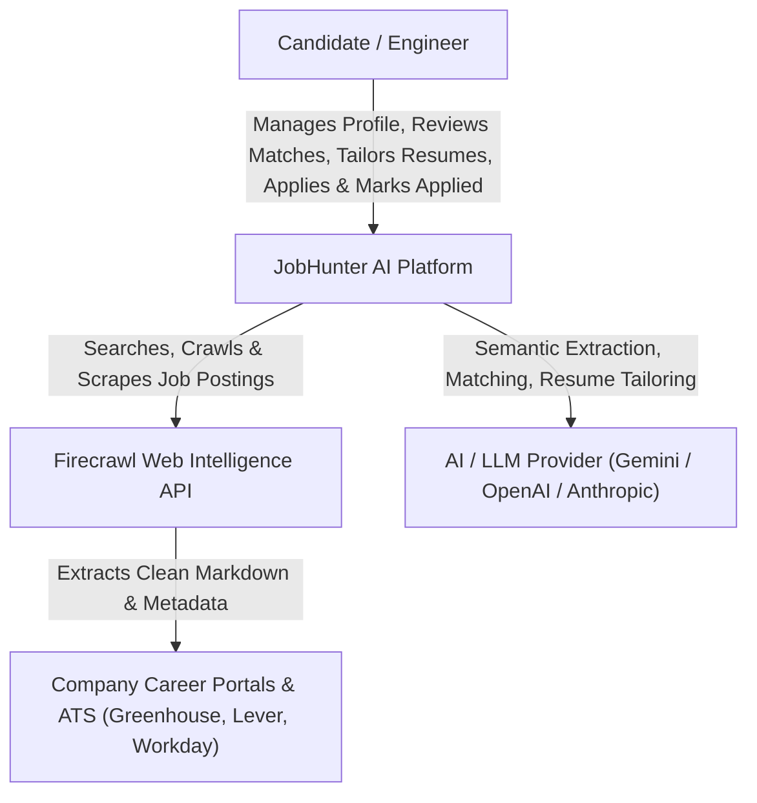
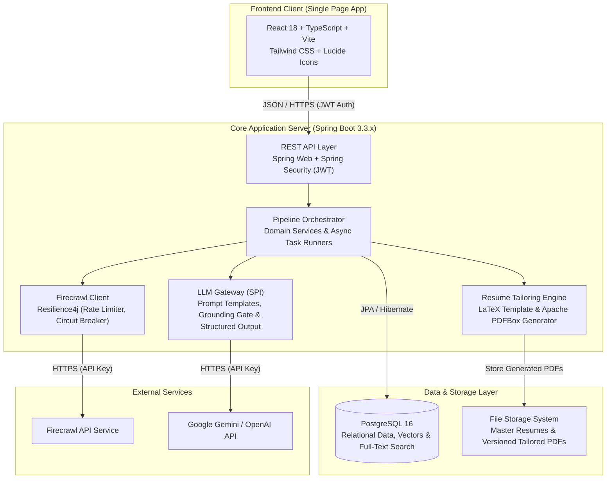
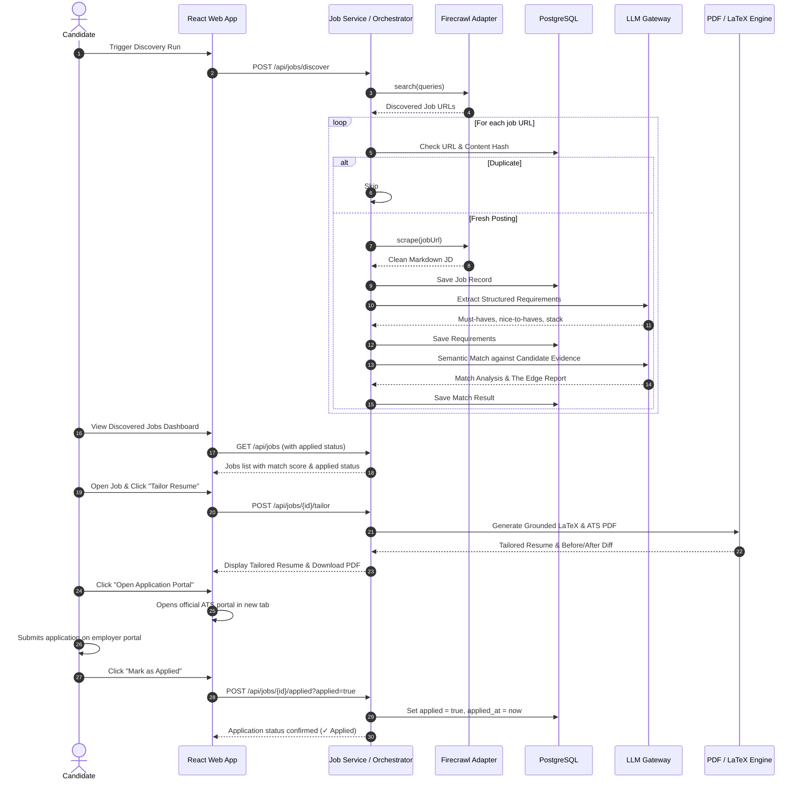

# JobHunter AI — System Architecture

## 1. Architectural Philosophy & Principles

The architecture of **JobHunter AI** follows four non-negotiable principles:
1. **Modularity & Loose Coupling**: Clear separation between Web Intelligence (Firecrawl), Backend Business Logic (Spring Boot), AI Reasoning (LLM Gateway), Resume Tailoring Engine (LaTeX/PDFBox), and Presentation (React).
2. **Deterministic-First Execution**: Never use LLMs for tasks that can be performed deterministically (URL normalization, content deduplication, filtering, state persistence, regex parsing, score weighting). Use AI strictly for semantic understanding, synthesis, and text tailoring.
3. **Pluggable AI & Web Intelligence**: The system is completely decoupled from any single LLM or scraping provider. The AI layer is modeled as an abstract SPI (Service Provider Interface), allowing seamless hot-swapping between Gemini, Anthropic Claude, OpenAI, or local Ollama instances.
4. **Observable & Traceable State**: Every agent run, LLM invocation, cost metric, and state update is recorded in PostgreSQL with audit logs for total transparency.

---

## 2. High-Level System Topology (C4 Model)

### 2.1 System Context (C4 Level 1)

### 2.2 Container Diagram (C4 Level 2)

---

## 3. Technology Stack Breakdown

| Layer | Technology | Version | Rationale & Selection Criteria |
| :--- | :--- | :--- | :--- |
| **Backend Framework** | Spring Boot | 3.3.4+ | Enterprise robustness, strong type safety, mature ecosystem, native JPA/Hibernate, Spring Security. |
| **Language Runtime** | Java | 17 LTS | Modern language features (Records, Pattern Matching, Sealed Classes, Text Blocks), high throughput. |
| **Frontend Framework** | React + Vite | 18.3+ | Rapid HMR, minimal bundle overhead, declarative component state, TypeScript native. |
| **Styling & Icons** | Tailwind CSS + Lucide | 3.4+ | Utility-first design system, dark-mode optimized, consistent iconography. |
| **Primary Database** | PostgreSQL | 16+ | ACID compliance, JSONB documents, vector embeddings (`pgvector` or in-memory vector fallback). |
| **Database Migrations**| Flyway | 10+ | Version-controlled, reproducible DDL migrations. |
| **Web Scraping Engine**| Firecrawl API | v1 | LLM-ready clean markdown extraction, site mapping, intelligent search queries, anti-bot handling. |
| **Resilience Layer**   | Resilience4j | 2.2+ | Circuit breakers, retry with exponential backoff, rate limiters on outbound Firecrawl and LLM calls. |
| **Document Compiler**  | LaTeX / PDFBox | 3.0.3 | Deterministic, ATS-parseable single-column PDF resume rendering. |

---

## 4. Key Subsystem Architectures

### 4.1 Firecrawl Ingestion & Deduplication Pipeline
* **Search Query Generator**: Formulates targeted multi-variable queries from candidate profile.
* **Source Adapters**: Specialized extractors for Greenhouse, Lever, Ashby, Workday, and generic career pages.
* **Three-Tier Deduplication**:
  * Tier 1: Canonical URL normalizer + SHA-256 URL hash check.
  * Tier 2: Content fingerprinting (SHA-256 of cleaned JD text).
  * Tier 3: Cross-source duplicate opportunity detection via company + normalized title + Jaccard token similarity (>75%), preserving distinct office locations.
* **Intelligent Query Generation**: Multi-tier search strategy generation (EXACT, ADJACENT, SKILL_LED) targeting ATS career boards.

### 4.2 LLM Reasoning & Grounding Verification Gate
* **Deterministic Grounding Verification**:
  * Ensures every skill, bullet claim, and metric is backed by verified candidate experience or projects.
  * Hallucinated technologies or unverifiable claims are rejected and surfaced transparently in the Rejection Audit.
* **Token Observability**:
  * Tracks prompt tokens, completion tokens, and calculated cost.

### 4.3 Intelligent Job Prioritization Engine
* **JobPrioritizationService**:
  * Evaluates hard constraints (Seniority gap >= 2.5 yrs, Executive title barrier, Missing mandatory domain stack, Strict on-site location mismatch).
  * Deterministic priority categorization: `HIGH_PRIORITY`, `MEDIUM_PRIORITY`, `LOW_PRIORITY`, `NOT_RECOMMENDED`.
  * Freshness evaluation: `NEW`, `RECENT`, `OLDER`, `STALE` (downranked), `UNKNOWN` (never fabricated).
  * Generates evidence-backed positives ("Why this job?") and transparent negative evidence ("Potential concerns").
  * Evaluates Key Technology coverage indicators (`✓`, `△`, `✕`).
  * Invariant to `applied` boolean state.
  * Zero hiring probability estimation.

### 4.3 Candidate Profile & Resume Engine
* **Master Profile Store**: Holds verified candidate experience, skills, projects, and achievements.
* **Master Resume**: Read-only baseline resume, never overwritten.
* **Tailoring Engine**:
  * Emphasizes proven skills and reorders sections for role relevance.
  * Sharpens bullets using JD terminology only when backed by candidate evidence.
  * Generates ATS-friendly standard single-column PDF documents via dual-engine compiler.

### 4.4 Human-Controlled Application Flow & Single Applied State
* **Single Application State**:
  * The system answers one simple question per job: *"Have I already applied to this job?"*
  * Modeled strictly as: `applied: boolean` and optional `appliedAt: timestamp`.
* **Human-Controlled Flow**:
  * User reviews job analysis and tailored materials.
  * User clicks `[ Open Application Portal ]` to open the employer's official portal in a new tab.
  * User clicks `[ Mark as Applied ]` to set `applied = true`.
  * User can click `[ Mark as Not Applied ]` to undo if clicked accidentally.
* **No Out-of-Scope Bloat**:
  * No multistage pipelines, no interview tracking, no rejection tracking, no offer tracking, no outcome-learning loop.

---

## 5. End-to-End Data Flow Sequence

---

## 6. Security & Data Protection
* **Tenant Isolation**: All operations scoped by authenticated candidate user ID.
* **Master Resume Immutability**: Read-only baseline resume guarantees candidate history is preserved.
* **Human-in-the-Loop Guarantee**: Zero automated background submissions; all portal navigation and final submissions are candidate-driven.
