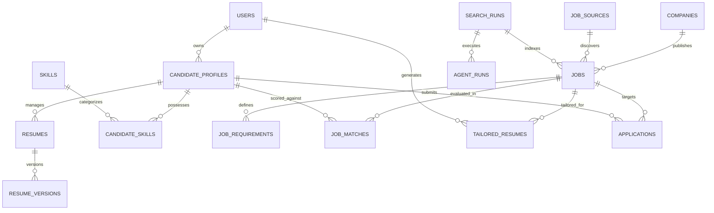

# JobHunter AI — Database Architecture & Schema Specification

## 1. Architectural Principles & Standards

The database design of **JobHunter AI** is guided by five foundational principles:
1. **Third Normal Form (3NF) Rigor**: Relational consistency across core entities (Users, Profiles, Applications, Companies).
2. **Hybrid Relational + Document Architecture**: Structured, queryable relational data combined with PostgreSQL `JSONB` for semistructured domain payloads (skills evidence, structured job specifications, grounding references).
3. **Explicit Auditability & Lineage**: Every resume tailoring change, search run, and agent execution carries strict foreign key lineage and timestamping.
4. **Idempotency & Deduplication First**: Strict unique constraints enforce canonical URL uniqueness and job content fingerprint deduplication.
5. **Ultra-Focused Application State**: Application state answers one single question: *"Have I already applied to this job?"* (`applied: boolean` and optional `applied_at: timestamp`). No bloated lifecycle stages, no interview tables, no outcome analytics.

---

## 2. Entity-Relationship Diagram (ERD)



---

## 3. Data Dictionary & Table Definitions

### 3.1 Authentication & User Management

#### `users`
Represents the system operator or candidate user.
```sql
CREATE TABLE users (
    id UUID PRIMARY KEY DEFAULT gen_random_uuid(),
    email VARCHAR(255) NOT NULL UNIQUE,
    password_hash VARCHAR(255) NOT NULL,
    first_name VARCHAR(100) NOT NULL,
    last_name VARCHAR(100) NOT NULL,
    role VARCHAR(50) NOT NULL DEFAULT 'CANDIDATE',
    created_at TIMESTAMPTZ NOT NULL DEFAULT CURRENT_TIMESTAMP,
    updated_at TIMESTAMPTZ NOT NULL DEFAULT CURRENT_TIMESTAMP
);
CREATE INDEX idx_users_email ON users(email);
```

---

### 3.2 Candidate Profile & Ground Truth Evidence

#### `candidate_profiles`
The root anchor of candidate truth.
```sql
CREATE TABLE candidate_profiles (
    id UUID PRIMARY KEY DEFAULT gen_random_uuid(),
    user_id UUID NOT NULL REFERENCES users(id) ON DELETE CASCADE,
    headline VARCHAR(255) NOT NULL,
    summary TEXT,
    years_of_experience NUMERIC(4,1) NOT NULL DEFAULT 0.0,
    current_location VARCHAR(150),
    preferred_locations JSONB NOT NULL DEFAULT '[]'::jsonb,
    work_modes JSONB NOT NULL DEFAULT '["REMOTE", "HYBRID"]'::jsonb,
    min_salary_inr NUMERIC(12,2),
    currency VARCHAR(10) NOT NULL DEFAULT 'INR',
    target_roles JSONB NOT NULL DEFAULT '[]'::jsonb,
    github_url VARCHAR(500),
    linkedin_url VARCHAR(500),
    portfolio_url VARCHAR(500),
    created_at TIMESTAMPTZ NOT NULL DEFAULT CURRENT_TIMESTAMP,
    updated_at TIMESTAMPTZ NOT NULL DEFAULT CURRENT_TIMESTAMP,
    CONSTRAINT uk_candidate_profiles_user UNIQUE (user_id)
);
```

#### `skills`
Master catalog of standardized technical skills.
```sql
CREATE TABLE skills (
    id UUID PRIMARY KEY DEFAULT gen_random_uuid(),
    name VARCHAR(100) NOT NULL UNIQUE,
    category VARCHAR(50) NOT NULL,
    aliases JSONB NOT NULL DEFAULT '[]'::jsonb,
    created_at TIMESTAMPTZ NOT NULL DEFAULT CURRENT_TIMESTAMP
);
CREATE INDEX idx_skills_name ON skills(name);
```

#### `candidate_skills`
Candidate-verified technical skills with evidence verification.
```sql
CREATE TABLE candidate_skills (
    id UUID PRIMARY KEY DEFAULT gen_random_uuid(),
    candidate_profile_id UUID NOT NULL REFERENCES candidate_profiles(id) ON DELETE CASCADE,
    skill_id UUID NOT NULL REFERENCES skills(id) ON DELETE RESTRICT,
    proficiency_level VARCHAR(50) NOT NULL,
    years_experience NUMERIC(4,1) NOT NULL DEFAULT 0.0,
    is_primary BOOLEAN NOT NULL DEFAULT FALSE,
    is_verified BOOLEAN NOT NULL DEFAULT TRUE,
    verification_source VARCHAR(50) NOT NULL DEFAULT 'MANUAL',
    confidence_score NUMERIC(3,2) NOT NULL DEFAULT 1.00,
    evidence_text TEXT,
    created_at TIMESTAMPTZ NOT NULL DEFAULT CURRENT_TIMESTAMP,
    updated_at TIMESTAMPTZ NOT NULL DEFAULT CURRENT_TIMESTAMP,
    CONSTRAINT uk_cand_skill UNIQUE (candidate_profile_id, skill_id)
);
```

---

### 3.3 Companies & Discovered Jobs

#### `companies`
Employer organizations publishing positions.
```sql
CREATE TABLE companies (
    id UUID PRIMARY KEY DEFAULT gen_random_uuid(),
    name VARCHAR(255) NOT NULL UNIQUE,
    domain VARCHAR(255),
    ats_provider VARCHAR(50),
    created_at TIMESTAMPTZ NOT NULL DEFAULT CURRENT_TIMESTAMP
);
```

#### `job_sources`
Platform or ATS origin of discovered listings.
```sql
CREATE TABLE job_sources (
    id UUID PRIMARY KEY DEFAULT gen_random_uuid(),
    name VARCHAR(100) NOT NULL UNIQUE,
    base_url VARCHAR(500) NOT NULL,
    source_type VARCHAR(50) NOT NULL,
    is_active BOOLEAN NOT NULL DEFAULT TRUE,
    created_at TIMESTAMPTZ NOT NULL DEFAULT CURRENT_TIMESTAMP
);
```

#### `jobs`
Individual job postings discovered across the web.
```sql
CREATE TABLE jobs (
    id UUID PRIMARY KEY DEFAULT gen_random_uuid(),
    company_id UUID NOT NULL REFERENCES companies(id) ON DELETE RESTRICT,
    job_source_id UUID NOT NULL REFERENCES job_sources(id) ON DELETE RESTRICT,
    title VARCHAR(255) NOT NULL,
    normalized_title VARCHAR(255),
    department VARCHAR(150),
    location VARCHAR(255),
    work_mode VARCHAR(50) NOT NULL DEFAULT 'UNKNOWN',
    employment_type VARCHAR(50) NOT NULL DEFAULT 'FULL_TIME',
    min_experience_years NUMERIC(4,1),
    max_experience_years NUMERIC(4,1),
    min_salary NUMERIC(12,2),
    max_salary NUMERIC(12,2),
    salary_currency VARCHAR(10) DEFAULT 'INR',
    job_url VARCHAR(1000) NOT NULL,
    canonical_url VARCHAR(1000) NOT NULL UNIQUE,
    url_hash CHAR(64) NOT NULL UNIQUE,
    content_hash CHAR(64) NOT NULL,
    raw_description_markdown TEXT NOT NULL,
    structured_job_spec JSONB,
    posting_date DATE,
    deadline_date DATE,
    is_active BOOLEAN NOT NULL DEFAULT TRUE,
    pipeline_status VARCHAR(50) NOT NULL DEFAULT 'DISCOVERED',
    created_at TIMESTAMPTZ NOT NULL DEFAULT CURRENT_TIMESTAMP,
    updated_at TIMESTAMPTZ NOT NULL DEFAULT CURRENT_TIMESTAMP
);
CREATE INDEX idx_jobs_canonical ON jobs(canonical_url);
CREATE INDEX idx_jobs_active_created ON jobs(is_active, created_at DESC);
```

---

### 3.4 Semantic Understanding & Match Analysis

#### `job_requirements`
Structured requirement extraction from raw job descriptions.
```sql
CREATE TABLE job_requirements (
    id UUID PRIMARY KEY DEFAULT gen_random_uuid(),
    job_id UUID NOT NULL REFERENCES jobs(id) ON DELETE CASCADE,
    requirement_type VARCHAR(50) NOT NULL,
    category VARCHAR(50) NOT NULL,
    raw_text TEXT NOT NULL,
    normalized_skill VARCHAR(100),
    years_experience_required NUMERIC(4,1),
    importance_weight NUMERIC(3,2) NOT NULL DEFAULT 1.0,
    is_implied BOOLEAN NOT NULL DEFAULT FALSE,
    created_at TIMESTAMPTZ NOT NULL DEFAULT CURRENT_TIMESTAMP
);
CREATE INDEX idx_job_reqs_job ON job_requirements(job_id);
```

#### `job_matches`
Multidimensional semantic match evaluation and intelligent priority ranking.
```sql
CREATE TABLE job_matches (
    id UUID PRIMARY KEY DEFAULT gen_random_uuid(),
    candidate_profile_id UUID NOT NULL REFERENCES candidate_profiles(id) ON DELETE CASCADE,
    job_id UUID NOT NULL REFERENCES jobs(id) ON DELETE CASCADE,
    overall_match_score NUMERIC(5,2) NOT NULL,
    priority_score INT NOT NULL,
    queue_tier VARCHAR(50) NOT NULL,
    recommendation VARCHAR(50) NOT NULL,
    analysis_payload JSONB NOT NULL,
    priority_category VARCHAR(50),
    freshness VARCHAR(50),
    days_since_posted INT,
    why_this_job JSONB NOT NULL DEFAULT '[]'::jsonb,
    potential_concerns JSONB NOT NULL DEFAULT '[]'::jsonb,
    requirement_coverage JSONB NOT NULL DEFAULT '[]'::jsonb,
    created_at TIMESTAMPTZ NOT NULL DEFAULT CURRENT_TIMESTAMP,
    updated_at TIMESTAMPTZ NOT NULL DEFAULT CURRENT_TIMESTAMP,
    CONSTRAINT uk_job_matches_profile_job UNIQUE (candidate_profile_id, job_id)
);
CREATE INDEX idx_job_matches_queue ON job_matches(queue_tier, priority_score DESC);
CREATE INDEX idx_job_matches_rec ON job_matches(recommendation);
CREATE INDEX idx_job_matches_priority ON job_matches(priority_category);
CREATE INDEX idx_job_matches_freshness ON job_matches(freshness);
```

---

### 3.5 Resume Tailoring Engine

#### `tailored_resumes`
Versioned tailored application resumes generated from verified candidate evidence.
```sql
CREATE TABLE tailored_resumes (
    id UUID PRIMARY KEY DEFAULT gen_random_uuid(),
    job_id UUID NOT NULL REFERENCES jobs(id) ON DELETE CASCADE,
    user_id UUID NOT NULL REFERENCES users(id) ON DELETE CASCADE,
    version_number INT NOT NULL DEFAULT 1,
    status VARCHAR(50) NOT NULL DEFAULT 'GENERATED',
    tailored_markdown TEXT NOT NULL,
    tailored_latex TEXT NOT NULL,
    pdf_storage_path VARCHAR(1000),
    pdf_file_size_bytes BIGINT,
    tailoring_plan_json JSONB NOT NULL DEFAULT '{}'::jsonb,
    validation_report_json JSONB NOT NULL DEFAULT '{}'::jsonb,
    ats_match_score NUMERIC(5,2),
    created_at TIMESTAMPTZ NOT NULL DEFAULT CURRENT_TIMESTAMP,
    updated_at TIMESTAMPTZ NOT NULL DEFAULT CURRENT_TIMESTAMP,
    CONSTRAINT uk_tailored_resumes_job_user_ver UNIQUE (job_id, user_id, version_number)
);
CREATE INDEX idx_tailored_resumes_job_user ON tailored_resumes(job_id, user_id);
```

---

### 3.6 Simple Application State Persistence

#### `applications`
Records whether the candidate has applied to a discovered job.
* **Scope Boundary**: No multistage lifecycles, no interview tracking, no rejection tracking, no outcome analytics.
* **Sole Purpose**: Answer *"Have I already applied to this job?"* to prevent duplicate submissions.

```sql
CREATE TABLE applications (
    id UUID PRIMARY KEY DEFAULT gen_random_uuid(),
    candidate_profile_id UUID NOT NULL REFERENCES candidate_profiles(id) ON DELETE CASCADE,
    job_id UUID NOT NULL REFERENCES jobs(id) ON DELETE CASCADE,
    applied BOOLEAN NOT NULL DEFAULT TRUE,
    applied_at TIMESTAMPTZ DEFAULT CURRENT_TIMESTAMP,
    created_at TIMESTAMPTZ NOT NULL DEFAULT CURRENT_TIMESTAMP,
    updated_at TIMESTAMPTZ NOT NULL DEFAULT CURRENT_TIMESTAMP,
    CONSTRAINT uk_application_candidate_job UNIQUE (candidate_profile_id, job_id)
);
CREATE INDEX idx_applications_cand_job ON applications(candidate_profile_id, job_id);
CREATE INDEX idx_applications_applied ON applications(candidate_profile_id, applied);
```

---

### 3.7 Execution Traceability & Cost Monitoring

#### `agent_runs`
Maintains operational telemetry, token consumption, and cost tracking.
```sql
CREATE TABLE agent_runs (
    id UUID PRIMARY KEY DEFAULT gen_random_uuid(),
    agent_name VARCHAR(100) NOT NULL,
    job_id UUID REFERENCES jobs(id) ON DELETE SET NULL,
    llm_provider VARCHAR(50),
    prompt_tokens INT NOT NULL DEFAULT 0,
    completion_tokens INT NOT NULL DEFAULT 0,
    estimated_cost_usd NUMERIC(8,5) NOT NULL DEFAULT 0.0,
    status VARCHAR(50) NOT NULL DEFAULT 'SUCCESS',
    error_message TEXT,
    execution_duration_ms BIGINT NOT NULL DEFAULT 0,
    created_at TIMESTAMPTZ NOT NULL DEFAULT CURRENT_TIMESTAMP
);
CREATE INDEX idx_agent_runs_job ON agent_runs(job_id);
CREATE INDEX idx_agent_runs_created ON agent_runs(created_at DESC);
```
