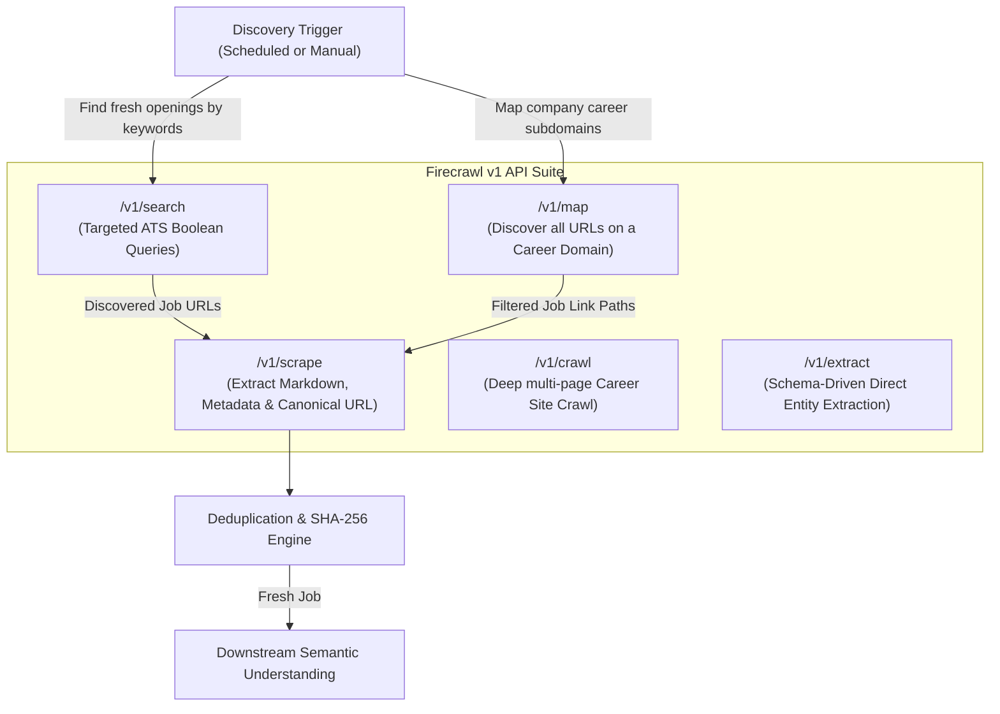
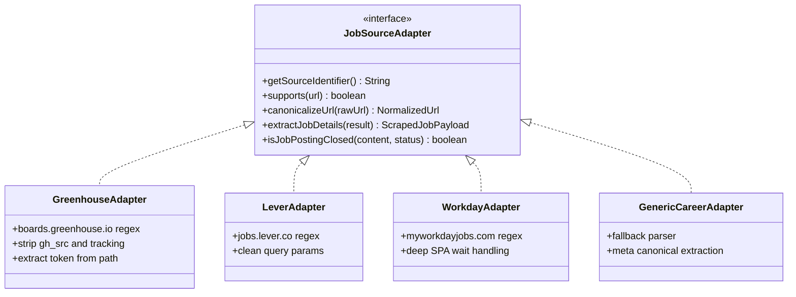

# JobHunter AI — Firecrawl Web Intelligence Integration

## 1. Architectural Role & Vision

**Firecrawl** serves as the first-class **Web Intelligence Engine** for JobHunter AI. Rather than relying on fragile local HTML scrapers or brittle headless browser scripts for initial discovery, Firecrawl provides:
1. **Clean Markdown & Content Extraction**: Strips navigation bars, cookie banners, tracking scripts, and styling to provide high-signal markdown for downstream AI understanding.
2. **Deep JS Rendering**: Renders dynamic Single Page Applications (SPAs) and React/Vue-based career portals.
3. **Advanced Web Search & Mapping**: Discovers fresh job listings matching candidate criteria across targeted ATS domains (`site:greenhouse.io`, `site:lever.co`, `site:ashbyhq.com`, `site:myworkdayjobs.com`).
4. **Structured JSON Extraction**: Leverages Firecrawl's `/v1/extract` endpoint for fast, schema-driven metadata extraction where applicable.

---

## 2. Firecrawl API Capabilities & Usage Matrix



### 2.1 Endpoint Utilization Details

| Endpoint | HTTP Method | Primary Use Case in JobHunter AI | Key Request Parameters |
| :--- | :--- | :--- | :--- |
| `/v1/search` | `POST` | Discovers newly indexed job postings across specified ATS domains matching candidate query. | `query`: `"Spring Boot" "PostgreSQL" site:boards.greenhouse.io India`<br>`limit`: 20<br>`scrapeOptions`: `{ formats: ["markdown"] }` |
| `/v1/scrape` | `POST` | Fetches clean markdown, metadata, and canonical URL from a specific job posting. | `url`: `https://...`<br>`formats`: `["markdown"]`<br>`onlyMainContent`: `true`<br>`waitFor`: 1500 |
| `/v1/map` | `POST` | Maps entire career subdomain to uncover job links before crawling. | `url`: `https://company.com/careers`<br>`search`: `engineering` |
| `/v1/crawl` | `POST` | Asynchronous deep crawling of multi-page company career sites. | `url`: `https://...`<br>`limit`: 50<br>`maxDepth`: 2 |

---

## 3. Pluggable Source Adapter Architecture

To ensure the system remains resilient and extensible as job boards evolve, scraping logic is decoupled into a **Source Adapter Pattern**.

### 3.1 Interface Definition
```java
public interface JobSourceAdapter {
    String getSourceIdentifier(); // e.g. "GREENHOUSE", "LEVER", "WORKDAY", "GENERIC"
    boolean supports(String url);
    NormalizedUrl canonicalizeUrl(String rawUrl);
    ScrapedJobPayload extractJobDetails(ScrapeResult firecrawlResult);
    boolean isJobPostingClosed(String pageContent, int httpStatusCode);
}
```

### 3.2 Supported Adapters & Strategies



1. **Greenhouse Adapter (`GreenhouseAdapter`)**:
   * Recognizes: `boards.greenhouse.io/*`, `job-boards.greenhouse.io/*`.
   * Cleans tracking parameters: `gh_src`, `gh_jid`, `token`.
   * Preserves application form anchor `/apply`.
2. **Lever Adapter (`LeverAdapter`)**:
   * Recognizes: `jobs.lever.co/*`.
   * Normalizes to base posting URL (stripping `/apply` or referral codes for deduplication).
3. **Workday Adapter (`WorkdayAdapter`)**:
   * Recognizes: `*.myworkdayjobs.com/*`.
   * Handles dynamic client-side rendering with `waitFor` directives in Firecrawl scrape options.
4. **Generic Career Adapter (`GenericCareerAdapter`)**:
   * Fallback for custom company career pages.
   * Extracts canonical URL directly from `<link rel="canonical">` provided in Firecrawl metadata.

---

## 4. Deduplication & Canonicalization Pipeline

Blindly scraping causes duplicate database records, wasted Firecrawl credits, and redundant LLM API charges. JobHunter AI implements a **Two-Tier Deduplication Strategy**:

```
                         Incoming Discovered Job URL
                                     │
                                     ▼
                ┌─────────────────────────────────────────┐
                │ Tier 1: URL Normalization & Sanitizing  │
                │ - Lowercase scheme & host               │
                │ - Remove tracking params (utm_*, etc.)  │
                │ - Strip trailing slashes & fragments    │
                └────────────────────┬────────────────────┘
                                     │
                                     ▼
                      [ Canonical URL Hash in DB? ] ─── Yes ───► [ DROP: Known URL ]
                                     │ No
                                     ▼
                ┌─────────────────────────────────────────┐
                │ Perform Firecrawl Scrape                │
                │ - Extract Clean Markdown                │
                │ - Extract Title & Company Name          │
                └────────────────────┬────────────────────┘
                                     │
                                     ▼
                ┌─────────────────────────────────────────┐
                │ Tier 2: SHA-256 Content Hashing         │
                │ content_hash = SHA-256(                 │
                │   clean(title) + "|" +                  │
                │   clean(company) + "|" +                │
                │   clean(first_1000_chars_of_body)       │
                │ )                                       │
                └────────────────────┬────────────────────┘
                                     │
                                     ▼
                      [ Content Hash in DB? ] ──────── Yes ───► [ DROP: Cross-Posted Duplicate ]
                                     │ No
                                     ▼
                          [ Ingest as Fresh Job ]
```

---

## 5. Posting Date & Stale Job Detection

### 5.1 Posting Date Resolution
* Scrapes structured JSON-LD (`"datePosted"`) if embedded in HTML metadata.
* Regex extraction from header markdown:
  * Pattern: `(Posted|Published|Date):\s*([A-Za-z0-9,\s]+)`
* Fallback to Firecrawl discovery timestamp if no explicit posting date is found.

### 5.2 Expired / Closed Job Detection
When refreshing shortlisted jobs or attempting application preparation, the system verifies listing validity:
1. **HTTP Status Code**: HTTP 404, 410, or 301 redirecting to a generic `/careers` page flags the job as `CLOSED`.
2. **Text Heuristics**: Detects standard closed-posting phrases in scraped markdown:
   * `"This job posting has expired"`
   * `"No longer accepting applications"`
   * `"This role has been filled"`
   * `"Position closed"`
3. If detected, `jobs.is_active` is updated to `FALSE` and any pending application is flagged.

---

## 6. Resilience, Rate Limiting & Courtesy

### 6.1 Resilience4j Configuration
```yaml
resilience4j:
  ratelimiter:
    instances:
      firecrawl:
        limitForPeriod: 10
        limitRefreshPeriod: 1m
        timeoutDuration: 5s
  circuitbreaker:
    instances:
      firecrawl:
        slidingWindowSize: 20
        failureRateThreshold: 50
        waitDurationInOpenState: 60s
        permittedNumberOfCallsInHalfOpenState: 5
  retry:
    instances:
      firecrawl:
        maxAttempts: 3
        waitDuration: 2s
        enableExponentialBackoff: true
        exponentialBackoffMultiplier: 2
        retryExceptions:
          - org.springframework.web.client.HttpServerErrorException
          - java.io.IOException
```

### 6.2 Politeness & Legal Awareness
* JobHunter AI accesses only publicly indexable, unauthenticated job postings.
* Adheres to Firecrawl's built-in robots.txt compliance rules.
* User-Agent transparency identifies legitimate requests.
* Never bypasses authentication barriers, paywalls, or private applicant portals.

---

## 7. Cost & Credit Optimization Strategy

Firecrawl credits are preserved through strict engineering discipline:
1. **Search Before Crawl**: Always run targeted `/v1/search` with strict ATS domain boundaries rather than crawling entire company domains.
2. **Deduplication Before Scraping**: Check URL hashes before calling `/v1/scrape`.
3. **Local Cache Tier**: Once scraped, raw markdown is permanently persisted in PostgreSQL. A URL is never re-scraped within a 14-day freshness window.
4. **Only Main Content**: Scrape requests set `onlyMainContent: true` to minimize returned payload sizes and memory consumption.
