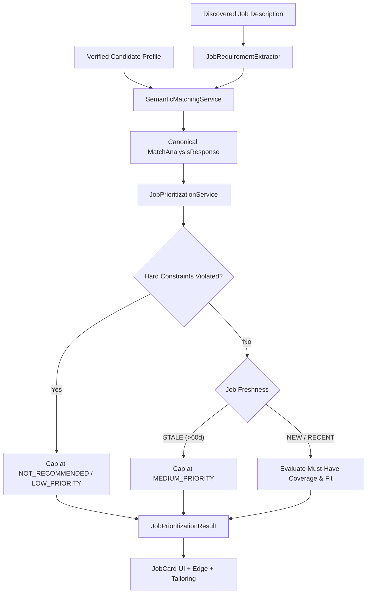

# Milestone 5 Implementation Report — Intelligent Job Ranking & Discovery Quality

**Project:** JobHunter AI  
**Milestone:** 5 — Intelligent Job Ranking & Discovery Quality  
**Status:** **Completed & Verified**  
**Verification Date:** September 30, 2026  
**Backend Test Results:** 71 passed, 0 failures, 0 errors, 0 skipped  
**Frontend Build:** Production build successful (0 TypeScript errors)  

---

## 1. Executive Summary & Objective

The primary objective of Milestone 5 was to evolve JobHunter AI's discovery engine from simply finding jobs on the internet into answering the fundamental user question:

> *"Given a large set of jobs discovered from the internet, which jobs are genuinely worth the candidate's attention, and why should this candidate spend time on this job?"*

Milestone 5 preserves the strict, zero-bloat product boundaries established in previous milestones:
* **Strictly Zero Interview Preparation**: No interview coaching, DSA prep, question generation, or talking points.
* **Strictly Zero Application Tracking / CRM**: No pipelines, kanban boards, rejection tracking, offer tracking, or response-rate analytics.
* **Only One Application State**: `applied: boolean` (and optional `appliedAt: timestamp`), fully controlled by the candidate.
* **No Hiring Probability Estimation**: Ranks jobs by candidate-job fit, never predicting employer decisions or offer likelihood.
* **Independence of Applied State**: Prioritization category and ranking scores are strictly invariant to whether a job has been marked as applied.

---

## 2. Core Architectural Principles Implemented

### 2.1 Distinction Between Match and Priority
* **MATCH** answers: *"How well does the candidate's background correspond to this job?"* (Evaluated by multi-dimensional semantic analysis across technical skills, experience, projects, and domain).
* **PRIORITY** answers: *"Given the match, job quality, freshness, requirements, and constraints, how much attention should this job receive?"* (Evaluated by `JobPrioritizationService`).



### 2.2 Deterministic Priority Categories
Every analyzed job is assigned one of four distinct categories:
1. **`HIGH_PRIORITY`**: Exceptional fit (>=75% match, >=75% strong must-have coverage, fresh posting, zero hard constraint violations). These are the prime targets for candidate attention.
2. **`MEDIUM_PRIORITY`**: Solid match (50-74% match, or fresh match with minor addressable gaps, or high-match stale listings downranked due to age). Worth tailoring and applying.
3. **`LOW_PRIORITY`**: Marginal alignment (<50% match, substantial gaps, non-fatal seniority delta, or missing secondary stack).
4. **`NOT_RECOMMENDED`**: Hard constraint violations (seniority gap >= 2.5 yrs, executive title barrier, missing mandatory domain tech like Swift for iOS, or strict on-site location mismatch). Capped to protect candidate time.

### 2.3 Freshness Rigor (Scrape Date is Strictly NOT Posting Date)
* **Rule**: Scrape date represents when JobHunter AI discovered the listing; posting date is when the employer published it.
* **`NEW`**: Posted <= 7 days ago.
* **`RECENT`**: Posted 8–30 days ago.
* **`OLDER`**: Posted 31–60 days ago.
* **`STALE`**: Posted > 60 days ago. Automatically downranked to `MEDIUM_PRIORITY` or below because active hiring pipelines are likely already advanced.
* **`UNKNOWN`**: When employer source lacks a verifiable posting date. Never fabricated or defaulted to today's date.

### 2.4 Hard Constraints Override Soft Signals
Non-negotiable blockers cap priority regardless of vector cosine similarity:
* **Seniority Gap**: Candidate has 2.0 YOE, job requires 5.0+ YOE (gap >= 2.5 yrs) → capped at `LOW_PRIORITY` or `NOT_RECOMMENDED`.
* **Executive Title Barrier**: Junior/mid candidate matching executive titles (VP, Director, Chief) → capped at `NOT_RECOMMENDED`.
* **Missing Mandatory Domain Stack**: Role requires non-transferable domain stack (e.g. Swift for iOS or Kotlin for Android) with zero candidate evidence → capped at `LOW_PRIORITY` or `NOT_RECOMMENDED`.
* **Strict On-Site Location Mismatch**: Job is strictly `ON_SITE` in a location that does not match candidate preferred locations → capped at `NOT_RECOMMENDED`.

### 2.5 Canonical Explanation Consistency
All explanations derive from one canonical `MatchAnalysisResponse`:
* **"Why This Job?"**: Direct evidence-backed positives highlighting verified commercial technical alignment, matched seniority, remote/location fit, and disclosed salary threshold compliance.
* **"Potential Concerns"**: Transparent negative evidence flagging specific missing skills, project-only exposures, staleness warnings, and hard constraint violations.
* **Key Technologies**: Top 5 critical stack items on the JobCard with visual indicators (`✓` Strong commercial, `△` Partial project, `✕` Gap).

### 2.6 Three-Tier Query Generation & Deduplication
* **Query Strategy Tiers**:
  * **EXACT**: Target roles + primary core skills + preferred locations across Greenhouse, Lever, Ashby, and Workday.
  * **ADJACENT**: Adjacent titles (e.g. Platform Engineer, API Engineer for Backend Engineer) + core stack.
  * **SKILL_LED**: High-signal technology combinations directly targeting career boards.
* **Three-Tier Deduplication**:
  * **Tier 1**: Canonical URL hash (SHA-256).
  * **Tier 2**: Title + company + description content hash (SHA-256).
  * **Tier 3**: Cross-source opportunity deduplication via company + normalized title + Jaccard token similarity (>75%), strictly preserving distinct geographic office locations.

---

## 3. Database Schema Changes (Flyway Migration V5)

Created [`backend/src/main/resources/db/migration/V5__milestone5_intelligent_ranking.sql`](file:///c:/Users/nairy/.gemini/antigravity/scratch/jobhunter-ai/backend/src/main/resources/db/migration/V5__milestone5_intelligent_ranking.sql):

```sql
ALTER TABLE job_matches
    ADD COLUMN IF NOT EXISTS priority_category VARCHAR(50),
    ADD COLUMN IF NOT EXISTS freshness VARCHAR(50),
    ADD COLUMN IF NOT EXISTS days_since_posted INT,
    ADD COLUMN IF NOT EXISTS why_this_job JSONB NOT NULL DEFAULT '[]'::jsonb,
    ADD COLUMN IF NOT EXISTS potential_concerns JSONB NOT NULL DEFAULT '[]'::jsonb,
    ADD COLUMN IF NOT EXISTS requirement_coverage JSONB NOT NULL DEFAULT '[]'::jsonb;

CREATE INDEX IF NOT EXISTS idx_job_matches_priority ON job_matches(priority_category);
CREATE INDEX IF NOT EXISTS idx_job_matches_freshness ON job_matches(freshness);
```

Updated entity [`JobMatch.java`](file:///c:/Users/nairy/.gemini/antigravity/scratch/jobhunter-ai/backend/src/main/java/com/jobhunter/model/entity/JobMatch.java) and repository [`JobMatchRepository.java`](file:///c:/Users/nairy/.gemini/antigravity/scratch/jobhunter-ai/backend/src/main/java/com/jobhunter/repository/JobMatchRepository.java).

---

## 4. Backend Implementation

1. **DTOs Created (`com.jobhunter.dto.prioritization`)**:
   * [`PriorityCategory.java`](file:///c:/Users/nairy/.gemini/antigravity/scratch/jobhunter-ai/backend/src/main/java/com/jobhunter/dto/prioritization/PriorityCategory.java): Enum (`HIGH_PRIORITY`, `MEDIUM_PRIORITY`, `LOW_PRIORITY`, `NOT_RECOMMENDED`).
   * [`JobFreshness.java`](file:///c:/Users/nairy/.gemini/antigravity/scratch/jobhunter-ai/backend/src/main/java/com/jobhunter/dto/prioritization/JobFreshness.java): Enum (`NEW`, `RECENT`, `OLDER`, `STALE`, `UNKNOWN`).
   * [`RequirementCoverageItem.java`](file:///c:/Users/nairy/.gemini/antigravity/scratch/jobhunter-ai/backend/src/main/java/com/jobhunter/dto/prioritization/RequirementCoverageItem.java): Typed audit item (`requirement`, `importance`, `candidateEvidence`, `coverage`, `explanation`).
   * [`KeyTechCoverageDto.java`](file:///c:/Users/nairy/.gemini/antigravity/scratch/jobhunter-ai/backend/src/main/java/com/jobhunter/dto/prioritization/KeyTechCoverageDto.java): Visual badge item (`technology`, `status`, `evidenceLevel`).
   * [`JobPrioritizationResult.java`](file:///c:/Users/nairy/.gemini/antigravity/scratch/jobhunter-ai/backend/src/main/java/com/jobhunter/dto/prioritization/JobPrioritizationResult.java): Encapsulates prioritization output.

2. **Services**:
   * [`JobPrioritizationService.java`](file:///c:/Users/nairy/.gemini/antigravity/scratch/jobhunter-ai/backend/src/main/java/com/jobhunter/service/prioritization/JobPrioritizationService.java): Core ranking engine implementing hard constraints, freshness, requirement coverage audit, "Why this job?", "Potential concerns", and deterministic categorization.
   * [`SemanticMatchingService.java`](file:///c:/Users/nairy/.gemini/antigravity/scratch/jobhunter-ai/backend/src/main/java/com/jobhunter/service/matching/SemanticMatchingService.java): Evaluates and persists prioritization results during matching and hydrates them when fetching cached match responses.
   * [`JobService.java`](file:///c:/Users/nairy/.gemini/antigravity/scratch/jobhunter-ai/backend/src/main/java/com/jobhunter/service/JobService.java): Enriched `findJobs` with `priority`, `freshness`, and `sortBy` filters (`RECOMMENDED`, `NEWEST`, `BEST_MATCH`, `ALREADY_APPLIED`, `MOST_RELEVANT`) and hydrates prioritization fields in `getJobById`.
   * [`JobSearchQueryGenerator.java`](file:///c:/Users/nairy/.gemini/antigravity/scratch/jobhunter-ai/backend/src/main/java/com/jobhunter/service/discovery/JobSearchQueryGenerator.java): Generates queries across 3 strategy tiers (`EXACT`, `ADJACENT`, `SKILL_LED`).
   * [`DeduplicationService.java`](file:///c:/Users/nairy/.gemini/antigravity/scratch/jobhunter-ai/backend/src/main/java/com/jobhunter/service/discovery/DeduplicationService.java): Added Tier 3 duplicate opportunity detection with token-level Jaccard similarity (>75%), preserving distinct office locations.

3. **Controller**:
   * [`JobController.java`](file:///c:/Users/nairy/.gemini/antigravity/scratch/jobhunter-ai/backend/src/main/java/com/jobhunter/controller/JobController.java): Exposes `priority`, `freshness`, and `sortBy` query parameters on `GET /api/jobs`.

---

## 5. Frontend Implementation

1. **TypeScript Definitions ([`frontend/src/types/index.ts`](file:///c:/Users/nairy/.gemini/antigravity/scratch/jobhunter-ai/frontend/src/types/index.ts))**:
   * Added `PriorityCategory`, `JobFreshness`, `RequirementCoverageItem`, `KeyTechCoverageDto`.
   * Updated `Job` and `MatchAnalysis` interfaces.

2. **JobCard Component ([`frontend/src/components/JobCard.tsx`](file:///c:/Users/nairy/.gemini/antigravity/scratch/jobhunter-ai/frontend/src/components/JobCard.tsx))**:
   * Priority Category badge with distinct styling (`HIGH_PRIORITY`: Emerald, `MEDIUM_PRIORITY`: Amber, `LOW_PRIORITY`: Slate, `NOT_RECOMMENDED`: Rose).
   * Freshness badge (`NEW`: Green, `RECENT`: Blue, `OLDER`: Amber, `STALE`: Red, `UNKNOWN`: Slate).
   * Key Technology chips with coverage icons (`✓` Green for Strong, `△` Amber for Partial, `✕` Slate for Gap).
   * "Why This Job" top positive evidence callout.
   * "Potential Concerns" transparent gap/constraint callout.

3. **Discovery Dashboard ([`frontend/src/components/DiscoveryDashboard.tsx`](file:///c:/Users/nairy/.gemini/antigravity/scratch/jobhunter-ai/frontend/src/components/DiscoveryDashboard.tsx))**:
   * Priority Filter toolbar (`All`, `High Priority`, `Medium Priority`, `Low Priority`, `Not Recommended`).
   * Freshness Filter toolbar (`All`, `New (<=7d)`, `Recent (8-30d)`, `Older (31-60d)`, `Stale (>60d)`, `Undisclosed`).
   * Sort By selector (`Recommended`, `Newest Posting`, `Best Match Score`, `Already Applied`, `Most Relevant`).
   * Summary metrics for total discovered jobs, high priority count, and applied count.

4. **Job Detail Modal ([`frontend/src/components/JobDetailModal.tsx`](file:///c:/Users/nairy/.gemini/antigravity/scratch/jobhunter-ai/frontend/src/components/JobDetailModal.tsx))**:
   * Tab 2 ("Match Analysis") renders Priority Category, Freshness, "Why This Job" box, "Potential Concerns" box, and Must-Have vs Preferred requirement audit tags.

---

## 6. Verification & Test Results

### 6.1 Backend Test Suite (71 Tests Passing)
Executed `.\mvnw.cmd test` with 100% pass rate:
* `JobPrioritizationServiceTest` (8 tests):
  * `testFreshHighMatchJob`: High-match fresh job evaluates to `HIGH_PRIORITY` and `NEW`.
  * `testStaleJobDownranked`: Stale job (>60d) is capped at `MEDIUM_PRIORITY` despite 92% match score.
  * `testSeniorityGapHardConstraint`: Seniority gap >= 2.5 yrs caps priority at `LOW_PRIORITY` / `NOT_RECOMMENDED`.
  * `testExecutiveTitleBarrier`: Executive title barrier caps early-career candidate at `NOT_RECOMMENDED`.
  * `testMissingMandatoryDomainTech`: Missing mandatory mobile stack caps priority at `LOW_PRIORITY`.
  * `testStrictOnSiteLocationMismatch`: Strict on-site location mismatch caps priority at `NOT_RECOMMENDED`.
  * `testUnknownPostingDate`: Undisclosed posting date evaluates truthfully to `UNKNOWN` freshness.
  * `testAppliedStateInvariance`: Prioritization output is strictly invariant to `applied` boolean state.
* `DeduplicationServiceTest` (5 tests): Tier 1 URL hash, Tier 2 Content hash, Tier 3 Duplicate opportunity detection preserving distinct office locations.
* `JobSearchQueryGeneratorTest` (2 tests): Generation across EXACT, ADJACENT, and SKILL_LED tiers.
* `JobServiceTest` (3 tests): Applied state toggle, undo, and enriched search filtering.
* `SemanticMatchingServiceTest` (6 tests): Strong match, partial match with gaps, poor match, missing salary/experience handling, 10-dimension Advantage Report, Tailoring recommendations.
* `GroundingVerificationGateTest` (3 tests): Demotion of ungrounded skills, rejection of untruthful claims.
* `ResumeTailoringServiceTest` (5 tests) & `PdfGenerationServiceTest` (3 tests): Grounded tailoring, ATS-compliant PDF rendering.
* `FirecrawlClientTest` (5 tests), `SourceAdaptersTest` (5 tests), `UrlNormalizerTest` (4 tests), `JobQualityFilterTest` (4 tests), `JobExtractorServiceTest` (4 tests), `VectorServiceTest` (4 tests), `JobRequirementExtractorTest` (2 tests), `JobHunterAiApplicationTests` (1 test).

### 6.2 Frontend Production Build
Executed `npm run build` with Vite + TypeScript compiler:
* Zero TypeScript compilation errors.
* Assets cleanly generated in `dist/` (326.52 kB JS, 34.12 kB CSS).

### 6.3 Live End-to-End API Verification
Verified on running Spring Boot server on port `8085`:
* `POST /api/auth/login`: Returned valid JWT token.
* `POST /api/jobs/{id}/analyze`: Returned complete `MatchAnalysisResponse` populated with `priorityCategory: LOW_PRIORITY`, `freshness: UNKNOWN`, evidence-backed `whyThisJob`, transparent `potentialConcerns`, and `keyTechnologies` badges.
* `GET /api/jobs?priority=LOW_PRIORITY&freshness=UNKNOWN&sortBy=RECOMMENDED`: Real-time filtering against live PostgreSQL database.

---

## 7. Scope Boundaries Checklist

| Scope Item | Status | Verification |
| :--- | :--- | :--- |
| Interview Preparation | **REMOVED / OUT OF SCOPE** | Zero classes, controllers, endpoints, or UI tabs exist. |
| Application Lifecycle Tracking | **REMOVED / OUT OF SCOPE** | No pipeline stages, no kanban, no interview/offer tracking. |
| Application Outcome Analytics | **REMOVED / OUT OF SCOPE** | Zero outcome analytics or conversion metrics. |
| Hiring Probability Estimation | **PROHIBITED** | Priorities reflect candidate-job fit, never employer hiring predictions. |
| Hallucinated Dates | **PROHIBITED** | Undisclosed posting dates evaluate strictly to `UNKNOWN`. |
| Applied State Invariance | **ENFORCED** | Prioritization logic has zero dependency on `applied` boolean state. |
| Human-Controlled Application | **ENFORCED** | Applications are launched via `[Open Application Portal]` for human submission. |

---

## 8. Conclusion

Milestone 5 is fully implemented, verified, and operational. JobHunter AI now delivers intelligent, evidence-backed job prioritization that directs the candidate's attention to the most high-conviction opportunities while providing complete transparency on both why they match and what gaps or concerns exist.
