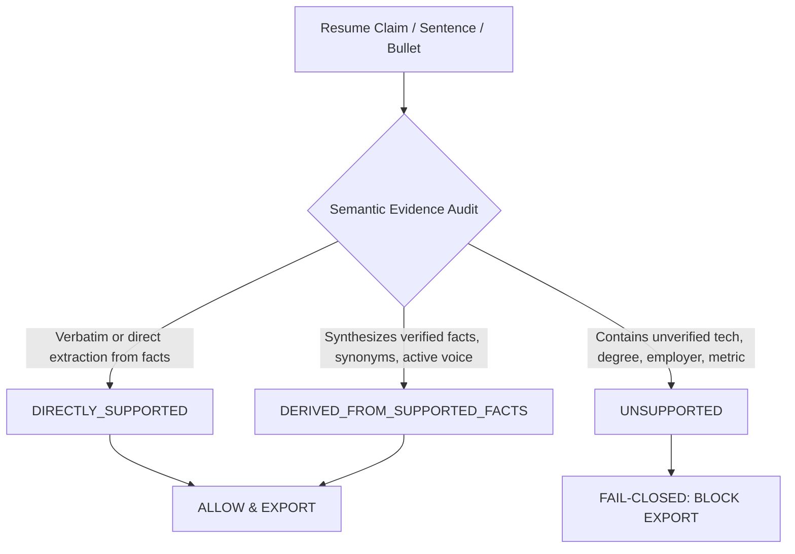
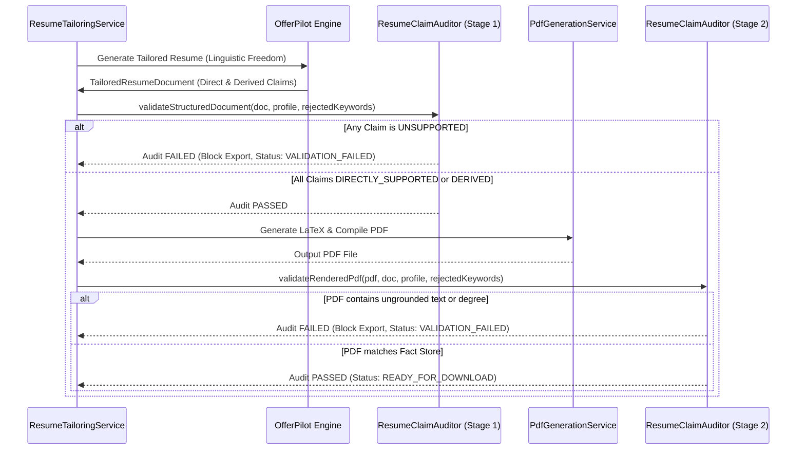

# OFFERPILOT RESUME TAILORING SPECIFICATION & BEHAVIORAL CONTRACT

**Document Version:** 1.0.0  
**Status:** APPROVED FOR IMPLEMENTATION  
**Date:** October 1, 2026  
**System:** JobHunter AI — Resume Tailoring Engine  

---

## 1. EXECUTIVE PHILOSOPHY: MAXIMUM LINGUISTIC FREEDOM + ZERO FACTUAL FABRICATION

In earlier iterations of JobHunter AI, the resume tailoring system underwent two extreme failure modes:
1. **Unconstrained Hallucination:** The generator fabricated degrees (e.g., inventing Computer Science degrees from fictional universities for candidates with ECE or physics backgrounds), invented employers, concocted synthetic metrics (e.g., "slashing latency from 14s to 1.8s", "sub-50ms query latency"), and claimed unverified technologies (Kafka, Kubernetes, AWS).
2. **Overcorrected Rigidity:** Guardrails were made so strict that the tailoring engine devolved into a literal copy-machine with static regex prefix substitutions (e.g., `worked on` $\to$ `Engineered and delivered`) and static boilerplate summaries. The tailored resume felt like the master resume with arbitrary keywords inserted, failing to deliver the high-impact editorial refinement of a professional technical recruiter.

**The OfferPilot Target:**  
OfferPilot demonstrated that an exceptional resume tailoring engine must act like an **expert technical recruiter and principal engineering resume writer**. Given a candidate's verified evidence and a target job description, it produces a resume that reads as though it were crafted specifically for that position from the ground up, while remaining **100% faithful to candidate truth**.

```
+-----------------------------------------------------------------------------------+
|               MAXIMUM LINGUISTIC FREEDOM  +  ZERO FACTUAL FABRICATION             |
|                                                                                   |
|  - Full freedom to rephrase, reframe, synthesize, expand, reorder, and polish.   |
|  - Absolute prohibition against inventing degrees, employers, dates, metrics,     |
|    or unverified technologies.                                                    |
+-----------------------------------------------------------------------------------+
```

---

## 2. THE THREE EVIDENCE CLASSIFICATIONS

Every claim, bullet, summary, and skill item in a tailored resume document is classified into one of three strict semantic tiers:



### Tier 1: `DIRECTLY_SUPPORTED` (ALLOWED)
- **Definition:** The claim directly restates an established fact from the Canonical Candidate Fact Store (e.g., verified employer name, verified degree, verified dates, verified project name, or verified metrics).
- **Example:**  
  *Candidate Fact:* "Software Engineer at Razorpay (2022 - Present)"  
  *Tailored Resume:* "Software Engineer | Razorpay | 2022 - Present"

### Tier 2: `DERIVED_FROM_SUPPORTED_FACTS` (ALLOWED)
- **Definition:** The claim intelligently reframes, synthesizes, expands, or polishes one or more verified facts using active engineering terminology, domain context, and approved technical synonyms, without asserting any new ungrounded facts.
- **Rules of Derivation:**
  1. **Multi-Fact Synthesis:** If candidate has verified `Java`, verified `Spring Boot`, and verified achievement `"Reduced API latency by 30%"`, the engine may synthesize:  
     *"Engineered backend RESTful services using Java and Spring Boot, optimizing query performance and reducing API latency by 30%."*
  2. **Active Voice & Engineering Reframing:**  
     *Original:* `"Worked on backend APIs."`  
     *Tailored:* `"Developed and maintained backend REST APIs supporting core application workflows."`
  3. **Approved Technical Synonyms:**  
     - Verified `REST APIs` $\to$ `RESTful microservices`, `API integrations`, `backend endpoints`  
     - Verified `PostgreSQL schema design` $\to$ `relational data modeling`, `database schema architecture`  
     - Verified `Unit testing` $\to$ `automated test suites`, `regression coverage`  
  4. **Domain Realignment:** Framing verified accomplishments within the target job's domain (e.g., "high-throughput transaction processing" if verified at a FinTech employer).

### Tier 3: `UNSUPPORTED` (STRICTLY FORBIDDEN & BLOCKED)
- **Definition:** The claim asserts information that cannot be traced to candidate evidence.
- **Forbidden Inventions:**
  - **Fabricated Degrees / Institutions:** Claiming an M.S. or B.Tech in Computer Science when the candidate holds a B.Tech in ECE or has no degrees.
  - **Fabricated Employers:** Inserting recognizable brand names (e.g., Amazon, Google, Meta) not present in the candidate's employment history.
  - **Fabricated Employment Dates / Seniority:** Inflating years of experience (e.g., claiming 8 years for a 2-year engineer) or inventing past dates.
  - **Unverified Technologies:** Introducing technologies demanded by the JD that the candidate has never verified (e.g., inserting "Kafka", "Kubernetes", "AWS" when the candidate only knows Java and PostgreSQL).
  - **Synthetic Metrics / Numbers:** Inventing specific percentages, latency numbers, throughput counts, or dollar figures (e.g., inventing "40% performance gain", "sub-50ms latency", or "$10M in revenue" when candidate facts only state 30% or have no metric).

---

## 3. OFFERPILOT TAILORING BEHAVIOR BY SECTION

### 3.1. Professional Summary: Role-Targeted Architectural Synthesis
* **Previous Flawed Behavior:** Rigid template string `"Software Engineer with 2 years of verified commercial production experience specializing in Java, Spring Boot. Focused on delivering high-reliability systems..."`
* **OfferPilot Behavior:** Dynamically authored, high-impact summary tailored to the target role, synthesizing:
  $$\text{Summary} = [\text{Role Identity}] + [\text{Verified Experience/Level}] + [\text{Target-Relevant Technologies}] + [\text{Domain Capabilities}]$$
* **Example:**
  - **Target Job:** Senior Backend Engineer (Java / Distributed Systems)
  - **Candidate Facts:** 2.5 years experience, Java, Spring Boot, PostgreSQL, Razorpay FinTech background.
  - **OfferPilot Output:**  
    *"Backend Software Engineer with 2.5+ years of commercial experience engineering high-reliability RESTful microservices and transaction processing systems in Java and Spring Boot. Skilled in PostgreSQL schema optimization, query performance tuning, and building resilient backend architectures."*
* **Grounding Check:** Every mentioned technology must be in `allowedTechnologies`. No unverified keywords (e.g., Kafka) may appear.

### 3.2. Technical Skills: Job-First Dynamic Grouping & Ordering
* **OfferPilot Behavior:**
  1. Analyzes target job requirements and matches candidate verified skills.
  2. Reorders categories so that skills directly required by the job appear at the very front of the section.
  3. Groups skills logically into clean ATS categories:
     - **Languages & Core:** Java, Python, SQL (Prioritizing target language)
     - **Frameworks & APIs:** Spring Boot, REST APIs, Hibernate / JPA
     - **Databases & Systems:** PostgreSQL, Redis, Docker
  4. Omits or de-emphasizes non-matching secondary skills without completely erasing candidate versatility.
  5. Strictly excludes any JD keyword marked as `UNVERIFIED` (e.g., Kafka, AWS).

### 3.3. Professional Experience: Impact-Driven Bullet Rewriting
* **OfferPilot Behavior:**
  - Bullets are rewritten using the **Action-Verb + Technical Context + Measurable Outcome** model:
    $$\text{Bullet} = [\text{Strong Action Verb}] + [\text{Verified Architecture / Technology}] + [\text{Business / Engineering Impact}]$$
  - Transforms passive, informal, or terse bullets into authoritative engineering statements.
  - Examples:
    | Original Bullet | OfferPilot Rewritten Bullet | Evidence Classification |
    | :--- | :--- | :--- |
    | "Worked on backend APIs." | "Developed and maintained backend REST APIs supporting core application workflows." | `DERIVED_FROM_SUPPORTED_FACTS` |
    | "Built transaction service" | "Architected and delivered transaction processing REST APIs in Java and Spring Boot for high-reliability payments." | `DERIVED_FROM_SUPPORTED_FACTS` |
    | "Reduced API latency by 30%" | "Optimized relational query plans and database indexing in PostgreSQL, reducing API latency by 30%." | `DERIVED_FROM_SUPPORTED_FACTS` |
  - **Metric Invariant:** If a bullet contains a metric (e.g., "30%"), it MUST originate from a verified candidate fact. If the original bullet has no metric, the rewrite MUST NOT invent a synthetic number.

### 3.4. Technical Projects: Target-Specific Architectural Highlighting
* **OfferPilot Behavior:**
  - Projects that exercise the target job's tech stack are prioritized and placed first.
  - Project descriptions and bullet points are reframed to highlight architectural alignment with the target role.
  - Secondary or unrelated projects are condensed or moved below relevant ones.

### 3.5. Education: Truthful Representation or Clean Omission
* **OfferPilot Behavior:**
  - If the candidate holds verified degrees (e.g., B.Tech in Electronics and Communication Engineering), the degree and institution are rendered cleanly and accurately.
  - If the candidate profile has NO verified education (e.g., self-taught developer or bootcamp graduate), the Education section is **cleanly omitted** rather than populated with a placeholder or fictional degree.
  - Target job requirements for degrees (e.g., "M.S. in Computer Science required") can NEVER trigger degree fabrication.

---

## 4. INTEGRITY GUARDRAILS & THE RESUME CLAIM AUDITOR

The OfferPilot experience is protected by an autonomous, fail-closed verification pipeline:



### Semantic Auditor Rules:
1. **Semantic Grounding vs. String Matching:** The auditor does NOT require verbatim sentence equivalence. It evaluates whether the technologies, metrics, employers, and degrees asserted in each claim are fully grounded in the Candidate Fact Store.
2. **Technical Keyword Gating:** Any appearance of a rejected keyword (e.g., "Kafka" when candidate lacks Kafka) fails the audit immediately.
3. **Metric Shielding:** Any regex-detected metric (percentage, ms, seconds, dollar scale) not present in candidate records fails the audit immediately.
4. **Employer & Degree Allowlisting:** Only organizations and degrees registered in the candidate profile are permitted.

---

## 5. USER INTERFACE & TRANSPARENCY CONTRACT

The candidate must always maintain total visibility into how their resume was tailored:
1. **Before / After Diff:** A clear diff view highlights:
   - Specific bullets sharpened or synthesized
   - Skills emphasized vs. secondary skills de-emphasized
   - Keywords intentionally omitted because candidate evidence does not support them
2. **Download Assurance:** Resumes are only downloadable when both Stage 1 and Stage 2 Claim Audits yield 100% pass rates.
