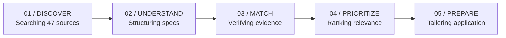

# JobHunter AI — Frontend Redesign Plan
## Visual & UX Architecture: ThreeUI Agent AI Grammar

**Reference Specification:** [ThreeUI Agent AI Landing Page](https://threeui.com/agent-ai-landing-page)  
**Product Scope:** Intelligent Job Search + Application Optimization  
**Design Philosophy:** Cinematic, Immersive, Technical, Minimal, Editorial, Dark, Spacious, Motion-Led, Progressive Disclosure

---

## 1. Current Frontend Architecture vs New Architecture

### Current Limitations:
* **Conventional SaaS Layout:** Stiff multi-column grid, heavy cards, boxed containers, dense badge clusters, and cluttered metric chips.
* **Premature Clutter:** Immediate exposure of filter bars, raw search logs, and card matrices before communicating system purpose or candidate alignment.
* **Modal Fatigue:** Opening a job displays a giant 1400-line multi-tab modal that overwhelms the user with raw data dumps.
* **Lack of Narrative:** The system feels like a static query against a database instead of an active intelligence agent scanning the web for the candidate.

### Target Architecture (Agent AI Paradigm):
* **Single-Surface Cinematic Journey:** One unified, spacious editorial flow starting with a full-viewport hero intelligence field.
* **Intent-Driven Activation:** A technical intent prompt ("FIND YOUR NEXT ROLE") triggers a 5-phase agent journey visualization (*01 Discover $\rightarrow$ 02 Understand $\rightarrow$ 03 Match $\rightarrow$ 04 Prioritize $\rightarrow$ 05 Prepare*).
* **Editorial Technical Specimen List:** Jobs presented with generous negative space, thin hairline rules, high-contrast index counters (`01`, `02`), priority specimens, and typography doing 90% of the visual communication.
* **Dedicated Immersive Inspection View:** Replacing the heavy modal with an editorial, multi-stage inspection drawer/canvas that progressively discloses *Why This Job*, *Match Readout*, *The Edge*, *Diagnostic Constraints*, *Resume Tailoring Diff Workstation*, and *Application Control*.

---

## 2. Component Mapping & Migration Strategy

| Current Component | New Redesigned Component | Responsibilities & UX Upgrade |
|---|---|---|
| `Navbar.tsx` | `SystemHeader.tsx` | Minimalist floating navigation: technical brand mark (`JOBHUNTER // OS`), live status indicator (`CORE ONLINE`), and view controls (`DISCOVERY`, `PROFILE`, `AUTH`). Recedes on scroll. |
| `DiscoveryDashboard.tsx` (Hero + Metrics) | `HeroIntelligenceField.tsx` | Full-screen immersive WebGL canvas featuring interactive orbital nodes, data streams, and dynamic statement *"Find the jobs worth your time."* |
| `DiscoveryDashboard.tsx` (Progress Steps) | `AgentJourneyPhases.tsx` | Visual 5-phase technical journey: `01 / DISCOVER`, `02 / UNDERSTAND`, `03 / MATCH`, `04 / PRIORITIZE`, `05 / PREPARE`. Synced with live Firecrawl discovery runs. |
| `JobFilters.tsx` + Search Buttons | `MinimalSearchInterface.tsx` | Clean technical prompt input (`Java / Spring Boot / Backend`) with quick-toggle location chips and an expandable micro-control for advanced constraints. |
| `JobCard.tsx` (Grid of cards) | `EditorialJobSpecimen.tsx` | Spacious, horizontal technical specimen entry with monospace numbering (`01`), restrained priority indicator, role/company, tech signals, and 1-line grounding rationale. |
| `JobDetailModal.tsx` | `JobIntelligenceDetail.tsx` | Full-height immersive inspection sheet with progressive disclosure: *Why This Job* $\rightarrow$ *System Match Gauges* $\rightarrow$ *The Edge* $\rightarrow$ *Constraints* $\rightarrow$ *Tailoring Workstation* $\rightarrow$ *Application Action*. |
| `CandidateProfileEditor.tsx` | `CandidateProfileEditor.tsx` | Dark technical workstation aesthetic, preserving all profile editing, skill inventory management, and master resume upload. |
| Three.js Canvas | `IntelligenceFieldScene.tsx` | Custom Three.js particle field with interconnected candidate and job nodes, orbital trajectory rings, and subtle ambient drift. Graceful 2D fallback for reduced motion. |

---

## 3. Design Tokens, Typography & Color Palette

### Color Palette (Restrained Technical Dark):
```css
/* Surface Tokens */
--color-bg-deep: #090a0d;         /* Canvas root - obsidian deep */
--color-bg-surface: #0e1015;      /* Elevated technical surface */
--color-bg-subtle: #14161d;       /* Subtle panels */
--color-border-hairline: rgba(255, 255, 255, 0.08); /* 1px hairline rules */
--color-border-active: rgba(255, 255, 255, 0.18);

/* Ink & Typography Tokens */
--color-ink-primary: #edeef0;     /* Crisp white high-contrast headings */
--color-ink-secondary: #9da3af;   /* Soft legible descriptive text */
--color-ink-muted: #5c6270;       /* Metadata, timestamps, hairline labels */

/* Intelligence Accent (Electric Emerald / Phosphor) */
--color-accent-emerald: #00f59b;  /* Primary intelligence signal */
--color-accent-cyan: #00e1ff;     /* Secondary stream signal */
--color-accent-amber: #eab308;    /* Stretch / Warning notice */
--color-accent-rose: #f43f5e;     /* Hard constraint violation */
```

### Typography Hierarchy:
* **Display Font:** Sans-serif Modern Grotesk (`Inter`, `-apple-system`, `BlinkMacSystemFont`) with tight tracking (`tracking-tight`, `tracking-tighter`) for cinematic headings (`text-4xl` to `text-7xl`).
* **Technical Monospace Font:** `JetBrains Mono` for index counters (`01`, `02`), phase badges (`01 / DISCOVER`), status readouts, tech tags, and diff views (`text-[10px]` to `text-xs`, `tracking-widest`, uppercase).

---

## 4. The 5-Phase Agent Journey



* **Live Status Connection:** When `isDiscovering === true`, the visual highlights the active phase step-by-step with real metrics (results found, pages scraped, jobs created, duplicates skipped).
* **Storytelling State:** When idle, the phases present the system's operational architecture with subtle ambient pulse.

---

## 5. WebGL / Three.js Visual Architecture (`IntelligenceFieldScene`)

* **Camera & Scene:** Perspective camera with subtle mouse-parallax movement and smooth damping.
* **Nodes & Geometries:**
  * Central Candidate Core Node (stable emerald beacon).
  * Web & ATS Orbital Field (rings representing Greenhouse, Lever, Ashby, Workday).
  * 120 Floating Data Points (particles representing discovered opportunities and signals).
  * Dynamic vector lines connecting candidate skills to high-relevance job nodes.
* **Performance Guarantees:**
  * Target: 60 FPS on standard integrated GPUs.
  * Auto-disables or simplifies on mobile devices and when `prefers-reduced-motion: reduce` is detected.
  * Disposes geometries and materials on unmount.

---

## 6. Implementation Phases

1. **Phase 1: Design System & Foundation**
   * Configure Tailwind tokens (`colors`, `fontFamily`, `animations`).
   * Add smooth scroll, custom scrollbar, and technical hairline utilities.
2. **Phase 2: Three.js Intelligence Field Canvas**
   * Create `IntelligenceFieldScene.tsx` with high-performance WebGL particles and orbital paths.
3. **Phase 3: System Header & Hero Experience**
   * Build `SystemHeader.tsx` and full-viewport `HeroIntelligenceField.tsx` with large statement and progressive reveal.
4. **Phase 4: Agent Journey Phases & Minimal Search**
   * Implement `AgentJourneyPhases.tsx` (5-phase interactive storytelling) and `MinimalSearchInterface.tsx`.
5. **Phase 5: Editorial Job Specimen List**
   * Re-architect job listing into a spacious, numbered editorial feed with restrained priority indicators.
6. **Phase 6: Dedicated Job Intelligence Detail Drawer**
   * Build progressive disclosure views: *Why This Job*, *Match Gauges*, *The Edge*, *Constraints*, *Application Action*.
7. **Phase 7: Resume Tailoring Diff Workstation**
   * Re-skin master vs tailored comparison into a clean dual-pane editor with grounded rationale and PDF download.
8. **Phase 8: Candidate Profile & Master Resume Integration**
   * Harmonize `CandidateProfileEditor.tsx` and `ResumeUploadModal.tsx` into the technical dark aesthetic.
9. **Phase 9: Mobile Responsiveness, Accessibility & Production Build Verification**
   * Verify keyboard navigation, ARIA attributes, responsive layout on small screens, and compile cleanly via `npm run build`.

---

## 7. Functionality Preservation Invariants

* **API Endpoints:** Zero modifications to backend routes (`/api/jobs`, `/api/jobs/discover`, `/api/jobs/{id}/analyze`, `/api/jobs/{id}/tailor`, `/api/profile`, etc.).
* **Applied State:** The `applied: boolean` toggle remains strictly user-controlled with instant visual indicator:
  `[ OPEN APPLICATION ]` $\rightarrow$ `[ MARK AS APPLIED ]` $\rightarrow$ `✓ APPLIED` (and `[ MARK AS NOT APPLIED ]`).
* **Zero Scope Creep:** Strictly NO interview prep, NO application CRM pipelines, NO outcome analytics, NO recruitment tracking.
